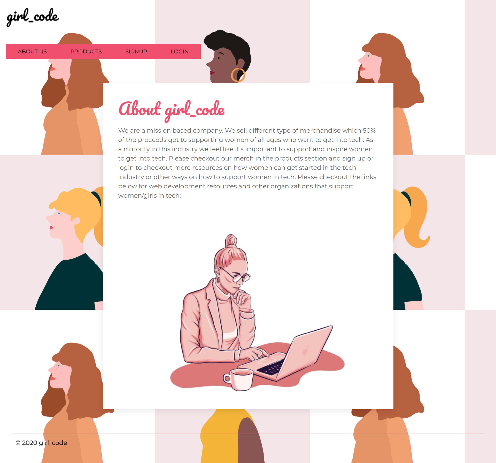

  # **girl_code**

  

  ## **Table of Contents** 
  * [Description](#Description)
  * [Installation](#Installation)
  * [Usage](#Usage)
  * [Contributions](#Contributions)
  * [Test](#Test)
  * [Questions](#Questions)

  ## Description 
  This e-commerce app sells products which a portion of the proceeds goes towards supporting women of all ages who want to get into the tech industry. When the login or signup they are also provided with resources on how to get started on web development and other organizations that support women in tech. 

  ## Installation
  1. npx create-react-app my-app
  2. connect client with server, this app uses Mongodb Atlas

  ## Usage 
  Run npm start from the root of the project.
  

  ## Contributions 
  Contributions are welcome. 
  Please submit a pull request or GitHub issue for any major changes. 
  
  ## Test 
  No testing 

  ## Questions 
 For any questions or issues, please email carolinaccez@gmail.com or visit github.com/carolinacez. 